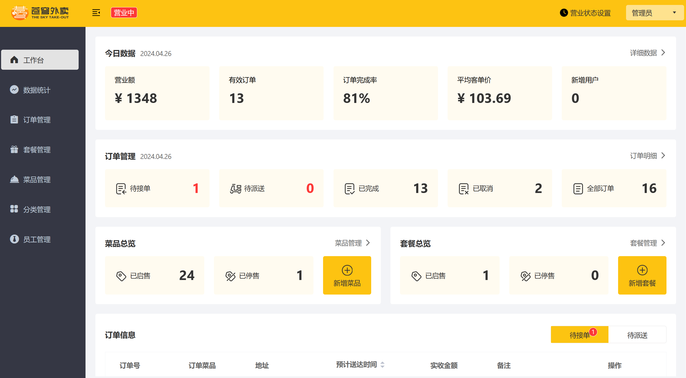
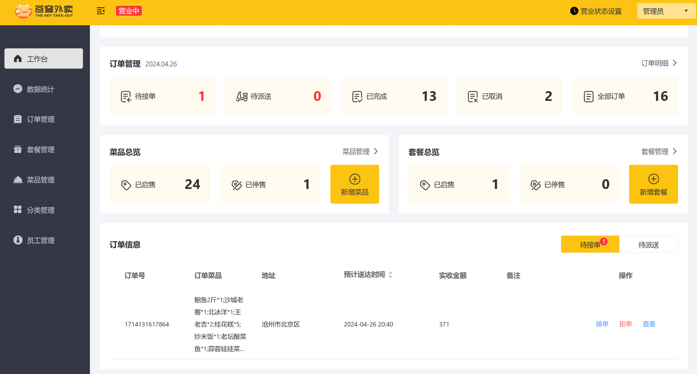
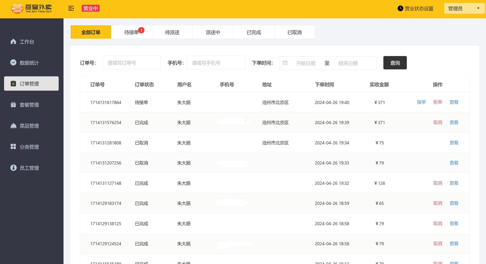
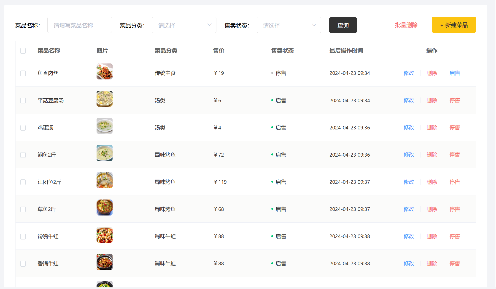

# 苍穹外卖 Sky-Take-Out（网页复刻版）

一套可在浏览器直接运行的外卖点餐系统，包含 **C 端 H5 点餐页**、**B 端原版 PC 管理后台**和 **Spring Boot 后端**。在原版“苍穹外卖”教学项目基础上去掉了微信小程序/微信支付依赖，改为账号密码登录 + 模拟支付，并对 Redis 缓存、订单幂等、超时取消等做了工程化加固。

## 技术栈

| 层 | 技术 |
| --- | --- |
| 后端 | Spring Boot 2.7.x、MyBatis、MySQL 8、Redis（Lettuce）、JWT、WebSocket、阿里云 OSS |
| C 端前端 | 原生 HTML/CSS/JS 单页应用（hash 路由，无构建） |
| B 端前端 | 原版 Vue + Element UI 编译产物（`html/sky`） |
| 反向代理 | nginx（静态托管 + 接口转发 + gzip + 缓存头） |
| JDK | 17，Maven 多模块 |

## 目录结构

```
heima_sky_take_out-main/
├── sky-common/                 # 通用工具、常量、异常
├── sky-pojo/                   # entity / dto / vo
├── sky-server/                 # 启动模块：controller / service / mapper / config / cache / task
│   └── src/main/resources/
│       ├── application.yml          # 主配置（JWT、Redis 超时、OSS 占位）
│       └── application-dev.yml      # 本地环境（数据库/Redis/OSS，已 gitignore，不入库）
├── Web/nginx-1.20.2/html/
│   ├── web-app/                # C 端 H5（http://localhost/）
│   └── sky/                    # B 端原版 PC 后台（http://localhost/admin/）
├── sky_web.sql                 # 网页版数据库初始化脚本（库名 sky_web）
└── sky_take_out.sql            # 原版脚本（保留备查）
```

## 环境要求与默认配置

| 组件 | 默认地址 | 说明 |
| --- | --- | --- |
| MySQL | `localhost:3307` | 库名 `sky_web`，账号 `root/1234`（见 `application-dev.yml`） |
| Redis | `localhost:6379` | 无密码；命令超时 1000ms（故障快速降级） |
| 后端 | `http://localhost:8080` | Spring Boot 端口 |
| nginx | `http://localhost:80` | 同时托管两个前端并转发接口 |

> 数据库/Redis/OSS 的连接信息都在 `sky-server/src/main/resources/application-dev.yml`，按本机环境修改即可。**该文件含 OSS AccessKey，已被 `.gitignore` 忽略，不入库。**

## 启动步骤

1. **建库导数据**：MySQL 中创建 `sky_web` 后导入 `sky_web.sql`（含表结构与初始账号/分类/菜品数据）。
2. **启动 Redis**：运行 `redis-server`（端口 6379）。
3. **启动后端**：在 `heima_sky_take_out-main` 执行
   ```bash
   mvn package -DskipTests
   java -jar sky-server/target/sky-server-1.0-SNAPSHOT.jar
   ```
   看到日志 `Started SkyApplication` 即成功（约 10~20 秒）。
4. **启动 nginx**：运行 `Web/nginx-1.20.2/nginx.exe`（建议用常驻进程方式运行，避免随终端退出）。

## 访问入口与账号

| 端 | 地址 | 账号 | 说明 |
| --- | --- | --- | --- |
| C 端 H5 | http://localhost/ | `zhangsan` / `123456` | 点餐、购物车、下单支付、订单、地址、我的 |
| B 端 PC 后台 | http://localhost/admin/ | `admin` / `123456` | 员工/分类/菜品/套餐/订单/店铺/报表/工作台 |

密码在库中为 MD5 存储。H5 登录请求体带 `role`（1 用户 2 商家），当前系统仅保留用户角色（商家功能统一在 PC 后台）。

## nginx 路由

| 路径 | 去向 |
| --- | --- |
| `/`、静态资源 | H5（`html/web-app`），HTML `no-cache`、css/js 5 分钟、图片字体 7 天，开启 gzip |
| `/admin/` | PC 后台（`html/sky`），hash 路由（`try_files` 回退 index.html） |
| `/api/` | 转发到 `http://localhost:8080/admin/`（PC 后台的接口前缀） |
| `/user/` | 转发到 `http://localhost:8080/user/`（H5 的接口前缀） |
| `/ws/` | 转发到后端 WebSocket（来单/催单提醒） |

## 图片上传（阿里云 OSS）

菜品/套餐图片通过 `POST /admin/common/upload` 上传到阿里云 OSS，返回可公开访问的 URL，需要在 `application-dev.yml` 配置自己的 `sky.alioss.*`（endpoint、access-key-id/secret、bucket-name），并把 bucket 读写权限设为**公共读**。未配置或密钥错误时接口返回“文件上传失败”。

## 核心功能与工程化加固

- **缓存三重防护**（统一封装在 `CacheClient`，覆盖菜品/套餐/报表读路径）
  - 穿透：非法参数入口拦截 + 空结果写 `CACHE_EMPTY` 占位（TTL 2 分钟）
  - 击穿：未命中时 `SET NX` 互斥锁（锁 TTL 10s）+ 双重检查 + Lua 按 owner 释放
  - 雪崩：TTL 附加 0~10% 随机抖动；Redis 故障 1s 快速失败 + 5s 熔断降级直查 MySQL
  - 写一致性：菜品/套餐写操作统一“**延迟双删**”（先删→更库→500ms 后异步再删），批量失效用 SCAN 替代 KEYS
- **店铺状态**：Redis `SHOP_STATUS` + JVM 本地 10s 缓存，Redis 故障时返回陈旧值兜底；H5 打烊时禁用加菜与结算按钮。
- **下单幂等**：`SET NX EX 5` 用户级防重锁（key `order:submit:lock:{userId}`）；订单号用 Redis `INCR` 按天生成序列。
- **支付幂等**：模拟支付，应用层校验订单状态（非待付款直接返回）+ 数据库条件更新 `where status=1`，重复点击不会重复置状态或重复通知商家。
- **超时取消**：Redis ZSet 延时队列（`order:expire`，每 5 秒扫描到期单）+ 每 5 分钟 DB 兜底扫描，支付/取消/超时都会移除队列成员；另每天凌晨 1 点自动完成派送超 60 分钟的订单。
- **登录防护**：用户连续登录失败 5 次锁定 10 分钟（`user:login:fail:{username}`）。

更多细节见 [接口文档.md](./接口文档.md)、[Redis改造测试用例.md](./Redis改造测试用例.md)、[三层缓存体系学习总结.md](./三层缓存体系学习总结.md)。

## 当前已知限制

- `POST /admin/dish/status/{status}`：控制器会清缓存，但 `DishServiceImpl.startOrStop()` 方法体为空，菜品启停状态实际不落库。
- `DELETE /admin/setmeal`：`SetmealServiceImpl.deleteBatch()` 方法体为空，接口返回成功但不删除数据。
- `PUT /admin/setmeal`：只更新套餐主表，不维护套餐-菜品关联关系。
- 打烊拦截目前只在 H5 前端，后端 `submitOrder` 未强制校验店铺状态（直接调接口仍可下单）。
- 报表缓存未做业务写时主动失效，最长可能陈旧 30 分钟（靠 TTL 自然过期）。

## 项目截图

- 

- 
- 
- 
- 
