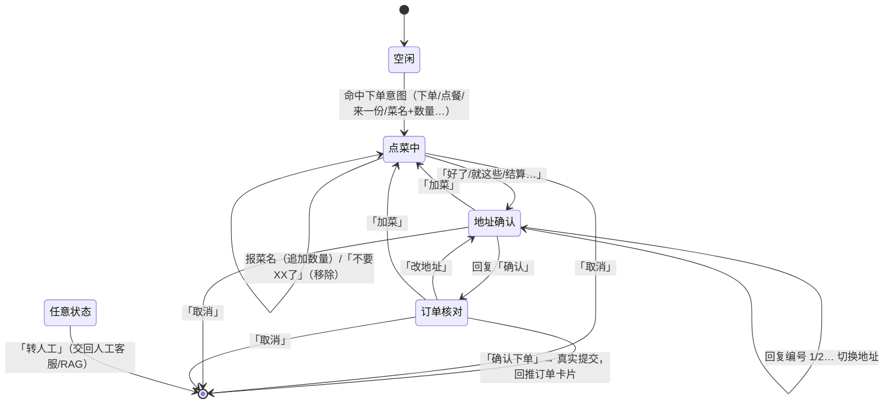

# 智能客服「帮客户下单」功能说明

> 本次为智能客服新增对话式代下单能力：用户在聊天窗口直接用自然语言报菜名，机器人引导确认菜品、地址后自动下单，并回推订单卡片。
> 改动日期：2026-10-06

---

## 一、功能效果

用户在「消息 → 商家客服」聊天窗口（智能客服模式）直接说话即可完成下单，全程无需离开聊天页：

```
用户：帮我下单：宫保鸡丁2份，鱼香肉丝1份
机器人：好的，已为你记下：
       · 宫保鸡丁 ×2  ￥56.00
       · 鱼香肉丝 ×1  ￥26.00
       小计 ￥82.00（另需配送费 ￥7.00）
       还需要别的菜吗？回复菜名继续添加，回复「好了」进入地址确认。

用户：再来两份麻婆豆腐        ← 支持多轮加菜、中文数量
用户：麻婆豆腐不要了          ← 支持移除
用户：好了

机器人：请确认配送地址（回复编号可切换）：
          1. 张三 138**** 新街大道一号楼8层801
       ✅ 2. 张三 138**** 中关村大街18号
          3. ……
       回复「确认」使用 ✅ 地址。

用户：2                       ← 可切换地址
用户：确认

机器人：请核对订单：
       · 宫保鸡丁 ×2  ￥56.00
       · 鱼香肉丝 ×1  ￥26.00
       ───
       商品合计 ￥82.00，配送费 ￥7.00
       应付：￥89.00
       配送地址：张三 138**** 中关村大街18号
       回复「确认下单」立即提交；回复「改地址」「加菜」可调整；回复「取消」放弃。

用户：确认下单
机器人：下单成功！订单号：20261006133929000002，应付 ￥89.00，
       请在 15 分钟内到「订单」页完成支付……
       〔蓝色订单卡片：待付款 ￥89.00，点击直达订单页支付〕
```

用户也可以在聊天页点击底部快捷短语 **「帮我下单 / 来份招牌 / 转人工」** 一键发起。

---

## 二、对话状态机



- 会话状态保存在后端内存（`ConcurrentHashMap`），**30 分钟无交互自动过期**。
- 地址必须经用户一次明确确认（「确认」），订单提交前还有一次完整核对（「确认下单」），共两道确认。

---

## 三、修改文件清单

### 新增（2 个 Java 文件）

| 文件 | 作用 |
| --- | --- |
| `sky-server/src/main/java/com/sky/service/ChatOrderService.java` | 对话下单服务接口，内含 `Result`（是否接管 + 回复列表）、`Reply`（文本/订单卡片）两个模型 |
| `sky-server/src/main/java/com/sky/service/impl/ChatOrderServiceImpl.java` | 对话下单状态机全部实现：意图识别、菜名/数量解析、会话流转、地址确认、金额计算、调用下单 |

### 修改（3 个文件）

| 文件 | 改动 |
| --- | --- |
| `sky-server/.../websocket/ChatWebSocketServer.java` | ① 注入 `ChatOrderService`；② 用户文本消息改为「下单状态机优先 → 人工模式 → RAG」三级处理；③ 状态机返回订单卡片时落库一条 `senderType=3 / msgType=2` 的机器人订单卡片消息并推送；④ 原 `asyncBotReply` 整理为 `asyncUserReply` + `replyViaRag`，去掉双层线程池 |
| `web-app/js/app.js` | ① 机器人发送的订单卡片加「智能客服·代下单」标识与蓝色样式钩子；② 聊天页新增快捷短语条（帮我下单/来份招牌/转人工）；③ 空会话引导文案补充下单示例 |
| `web-app/css/style.css` | 新增 `.chat-quick` 快捷短语条样式、`.chat-order-card.bot-order` 机器人蓝色订单卡片样式 |

> RAG 服务（Python，端口 8000）**未改动**；商家客服端（`kefu`）**未改动**（既有机器人消息/订单卡片渲染逻辑已兼容）。

---

## 四、后端实现要点

### 1. 消息处理优先级（ChatWebSocketServer）

用户每条文本消息按以下顺序处理：

1. **对话下单状态机**：存在进行中会话，或新消息命中下单意图 → 由机器人接管；
2. **人工模式**（用户此前点过「转人工」且无进行中下单会话）→ 直接广播给在线客服；
3. **RAG 智能问答** → 答不上再转人工（原逻辑不变）。

进行下单会话时即使客户端处于人工模式，「确认」「2」这类消息仍优先走状态机，避免流程错乱。

### 2. 菜名与数量解析（不依赖大模型，即时响应）

- 菜名：查库取全部在售菜品（`dish.status=1`），按名称长度降序做包含匹配，字符区间占位防止菜名互吃（如「宫保鸡丁」「鸡丁」）。
- 数量：正则提取 `阿拉伯数字 / 一二两三四五六七八九十 + 可选单位（份/个/盒/碗…）`，按距离就近分配给对应菜名；未提及数量默认 1 份。
- 支持一句话多菜：「宫保鸡丁2份，鱼香肉丝1份」；支持追加累加、「不要XX了」整道移除。
- 意图判定：强词（下单/点单/点餐/帮我点…）直接进入；弱词（来个/我要/再来…）或纯「菜名+数量」需同时命中菜名，避免「我要退款」误入下单。

### 3. 真实下单链路（与用户端结算页完全一致）

提交时在 WebSocket 线程通过 `BaseContext.setCurrentId(userId)` 模拟登录态后复用既有服务：

1. `shoppingCartService.addShoppingCart()` 按数量逐份加购物车；
2. 组装 `OrdersSubmitDTO`：`payMethod=1、deliveryStatus=1（立即送出）、tablewareStatus=1、packAmount=1`，与 H5 结算页一致；
3. 金额由服务端计算：**菜品合计（按当前菜品价格）+ 购物车已有商品合计 + 配送费 ￥7**；
4. 调 `orderService.submitOrder()` 走原有事务（校验地址、生成订单/明细、清购物车、15 分钟超时队列）；
5. 成功后回推文本提示 + 订单卡片（`msgType=2`，服务端生成快照，内容不可伪造），用户点击卡片直达订单页支付。

### 4. 安全与边界处理

- **地址保护**：只能使用本人地址簿中的地址，下单前必须明确确认；没有地址时引导去「我的 → 收货地址」新增，回来回复「好了」继续。
- **购物车保护**：提交前若购物车已有商品，核对文案中明确列出并告知「将一起结算」；下单失败时按快照把购物车恢复到操作前状态，不会残留机器人加的菜。
- **停售保护**：提交时发现菜品被停售，终止并提示重新下单。
- **防误触**：「取消」在点菜状态下且未点到具体菜名才生效（避免「不要香菜」被当成取消）；会话 30 分钟过期。
- 下单消息不推送给客服端、用户消息置已读，不产生未读红点（与机器人普通回复一致）。

---

## 五、前端改动

- **快捷短语条**：聊天输入框上方三个胶囊按钮，点击直接发送对应消息。
- **机器人订单卡片**：蓝色描边/蓝色标题栏/蓝色金额，标注「订单卡片·代下单」，点击跳转订单详情（可直接支付）。
- **空会话提示**：`还没有消息……也可以直接说「帮我下单：宫保鸡丁2份」`。

---

## 六、测试验证记录（2026-10-06，真实接口 + WebSocket 全链路）

| # | 用例 | 结果 |
| --- | --- | --- |
| 1 | 「帮我下单：宫保鸡丁2份，鱼香肉丝1份」多菜一句话解析 | ✅ 宫保鸡丁×2、鱼香肉丝×1，小计￥82 |
| 2 | 「再来两份麻婆豆腐」中文数量追加 | ✅ 麻婆豆腐×2，小计￥118 |
| 3 | 「麻婆豆腐不要了」移除 | ✅ 正确移除 |
| 4 | 「好了」进入地址确认，默认地址 ✅ 高亮 | ✅ |
| 5 | 回复「2」切换地址 | ✅ ✅ 移至编号2 |
| 6 | 「确认」核对订单（菜品/￥82+￥7=￥89/地址） | ✅ 金额地址正确 |
| 7 | 「确认下单」提交 | ✅ 订单号 20261006133929000002 落库，状态=待付款，回推订单卡片，购物车清空 |
| 8 | 浏览器截图核对 UI（蓝卡片/快捷条/气泡） | ✅ |
| 9 | Maven 编译打包 | ✅ 后端已用新 jar 重启（端口 8080） |

> 测试产生的待付款订单会在 15 分钟后被系统自动取消，无需手工处理。

---

## 七、部署 / 运行

- 后端已重新 `mvn package` 并以 `sky-server-1.0-SNAPSHOT.jar` 重启完成；纯内存会话，重启即清空，无数据库表结构变更。
- 前端为静态文件，浏览器 **Ctrl+F5 强刷** 即可（nginx 对 js/css 有 5 分钟缓存）。
- 不依赖 RAG 服务在线：下单解析全部在 Java 侧完成；RAG 仅继续负责普通知识问答。

---

## 八、后续可选增强（本期未做）

- 菜名/数量的大模型语义解析（应对口语化、别名、错别字）：可在 RAG 服务新增解析接口，Java 规则作为兜底。
- 会话状态改 Redis 存储，支持后端多实例部署。
- 支持菜品口味/规格选择、指定送达时间、备注（忌口等）。
- 无地址时支持聊天中直接收集「收货人+电话+详细地址」自动写入地址簿。
